# Computer Vision - Pyramids and Optical Flow
In this project I'll be doing the following:
1. Find a Large **[Optical Flow][1]** by using Lukas-Kanade algorithm.
2. [Image Alignment And Warping][2], Find a **Translation** matrix out of source image and **Rigid** transformation of it.
3. [Gaussian and Laplacian **Pyramids**][3].

**The files are as follows:**
* **ex1_main.py** - The main file script that runs the program.
* **ex1_utils.py** - The file that contains functions that are used in the program.
* **input** - folder contains the images before processing.
* **output** - folder contains images after the algorithms are applied.

_see more about:_  
[Optical Flow - Wikipedia](https://en.wikipedia.org/wiki/Optical_flow)  
[Image Transformations - TutorialsPoint](https://www.tutorialspoint.com/dip/image_transformations.htm)  
[Pyramid (image processing) - Wikipedia](https://en.wikipedia.org/wiki/Pyramid_(image_processing))
____

## Lucas-Kanade Optical Flow
Lucas–Kanade method is a widely used differential method for **optical flow estimation**.   
It assumes that the flow is essentially constant in a local neighbourhood of the pixel under consideration,  
and solves the basic optical flow equations for all the pixels in that neighbourhood, by the least squares criterion.    
* The first image id the result of the regular Optical Flow Algorithm.   
* The second image id the result of the improvement Optical Flow Algorithm by using Pyramids.   
* The third image is the comparison of the two algorithms.

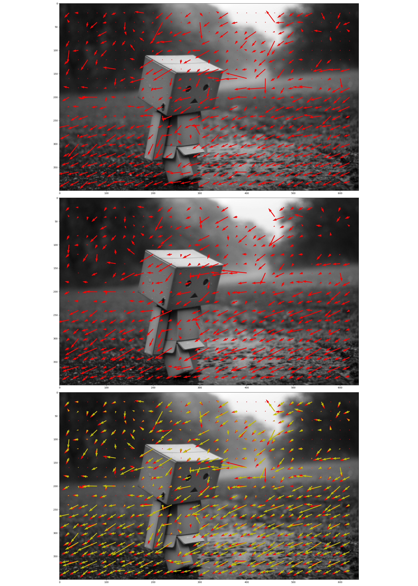

[Back to top ][4]
___

## Image Alignment and Warping

In this section we will find the parameters' alignment between 2 input images, where the second image  
was received after performing parametric motion of the first.

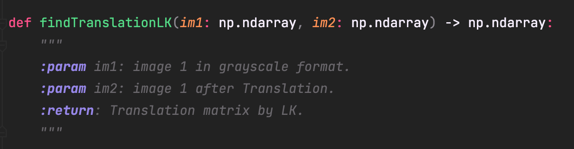
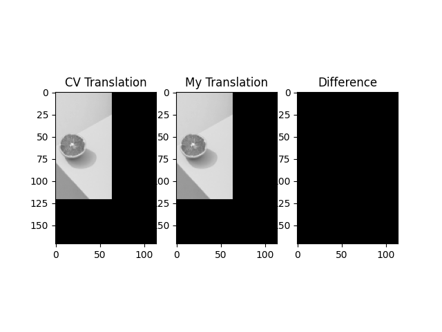

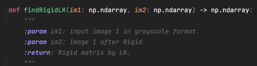
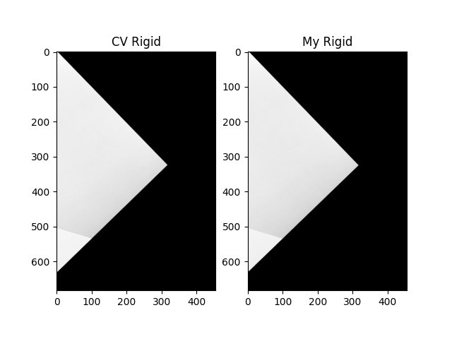

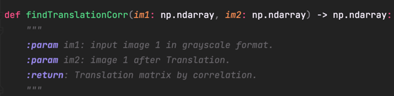
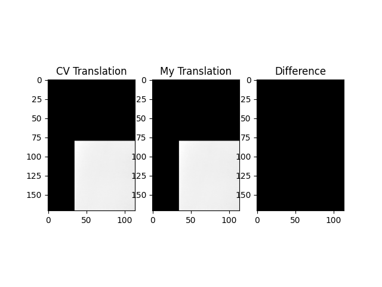

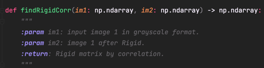
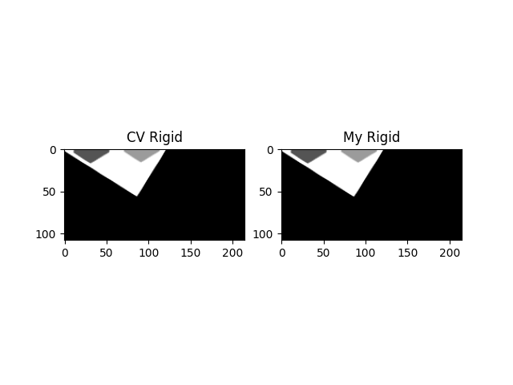

[Back to top ][4]
___

## Gaussian and Laplacian Pyramids

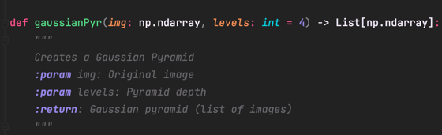
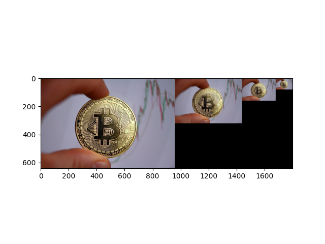

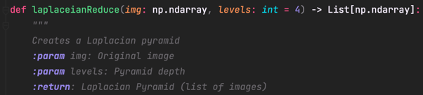
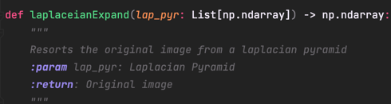
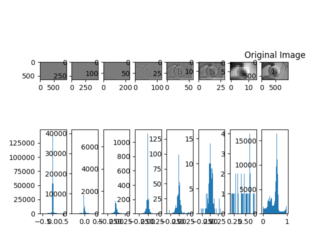

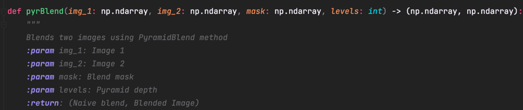
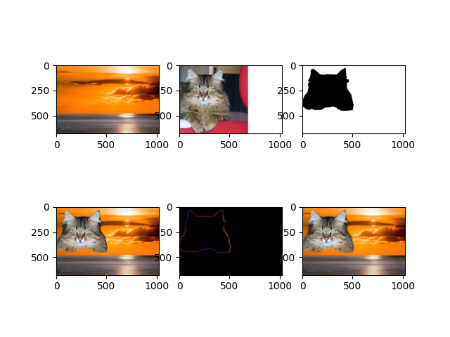

[Back to top ][4]
___
 
### Requirements & System preferences

* The system used to implement this project is Mac OS Monterey 12.3.1
* Python version is 3.8.9, using Pycharm.
* Libraries used:
  - [x] Open CV
  - [x] Numpy
  - [x] Matplotlib
  

[1]:#Lucas-Kanade-Optical-Flow "Optical Flow"
[2]:#Image-Alignment-and-Warping "Image Alignment And Warping"
[3]:#Gaussian-and-Laplacian-Pyramids "Gaussian and Laplacian Pyramids"
[4]:#Computer-Vision---Pyramids-and-Optical-Flow "Back to top"
