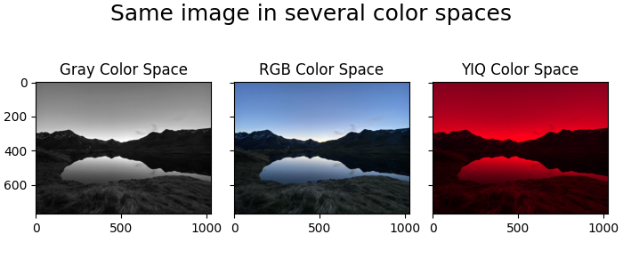
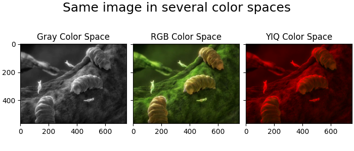
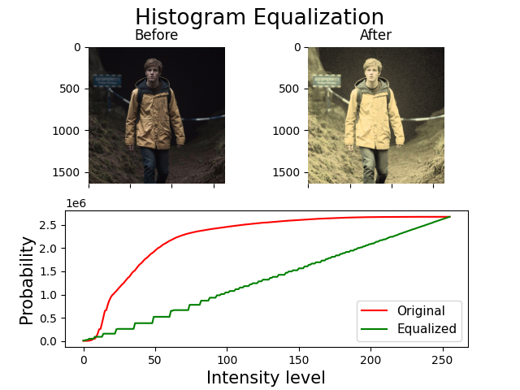
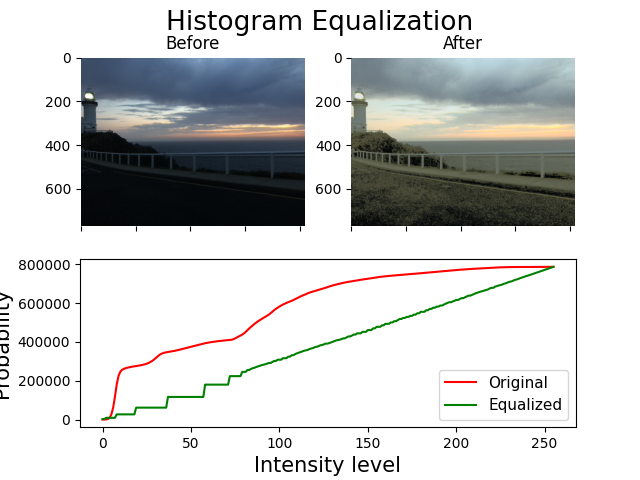
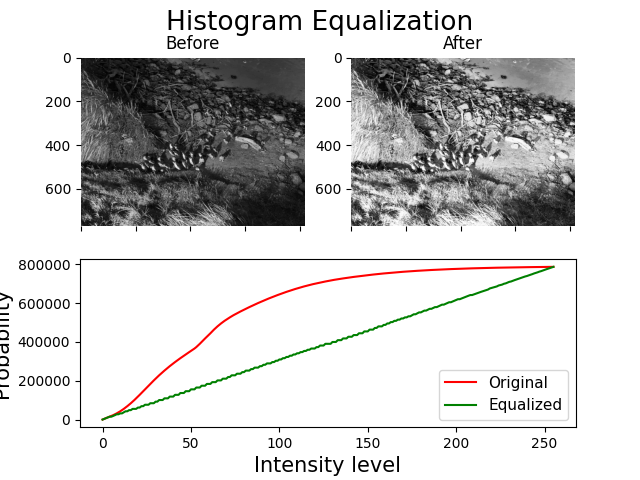
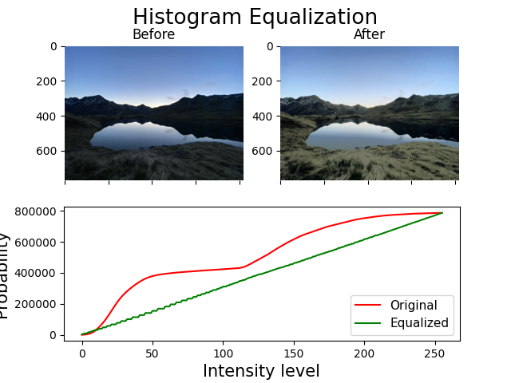
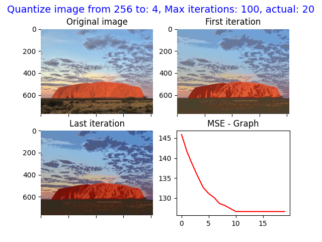
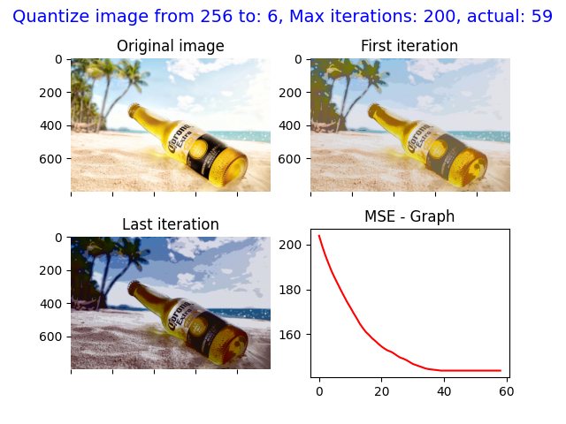
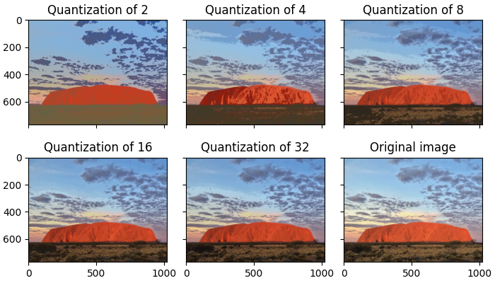
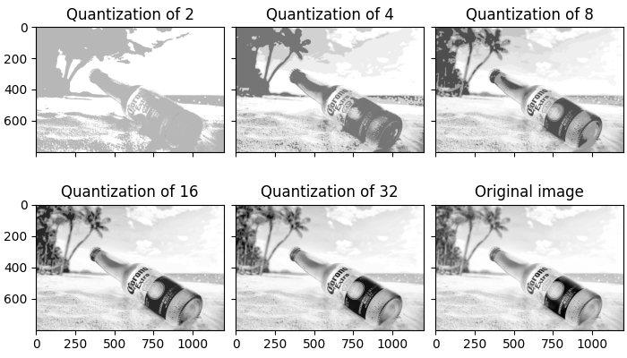

# Image Processing Assignment 1

This project is the first assignment in the course of Image Processing and Computer Vision.   
In this assignment I'll be doing the following:
1. Read and display an image given.
2. Convert an image between 2 color spaces - RGB and YIQ.
3. Perform [Histogram Equalization][1] on images.
4. Perform Image Quantization.
5. Perform Gamma correction on Images.  

[1]:hsitogramEqualize "Histogram Equalization"  

_see more:_  
[Histogram Equalization - Wikipedia](https://en.wikipedia.org/wiki/Histogram_equalization)  
[Image Quantization - Wikipedia](https://en.wikipedia.org/wiki/Quantization_(image_processing))  
[Gamma correction - Wikipedia](https://en.wikipedia.org/wiki/Gamma_correction)
____

## Convert an image between YIQ and RGB

Related functions at **_ex1_utils.py_**:
1. **transformRGB2YIQ**
   1. **param** - _imgRGB_ -> np.ndarray
   2. **return** - _imgYIQ_ -> np.ndarray
2. **transformYIQ2RGB**
   1. **param** - _imgYIQ_ -> np.ndarray
   2. **return** - _imgRGB_ -> np.ndarray

___

## Histogram Equalization

Related functions at **_ex1_utils.py_**:
1. **hsitogramEqualize**
   1. **param** - _imgOrig_ -> np.ndarray
   2. **return** - tuple:
      1. _imgEq_ -> np.ndarray -> new equalized image.
      2. _histOrg_ -> np.ndarray -> histogram of the original image.
      3. _histEQ_ -> np.ndarray -> histogram of the equalized image.

   

___

## Quantization

Related functions at **_ex1_utils.py_**:
1. **quantizeImage**  quantizeImage(imOrig: np.ndarray, nQuant: int, nIter: int) -> (List[np.ndarray], List[float]):
   1. **param** - _imgOrig_ -> np.ndarray
   2. **param** - _nQuant_ -> int -> amount of intensities to quantize.
   3. **param** - _nIter_ -> int -> amount of iterations to perform.
   4. **return** - tuple:
      1. _Images_list_ -> List[np.ndarray] -> list of the images after each iteration
      2. _MSE_list_ -> List[float] -> list of the MSE after each iteration
   

___

### Requirements

* The system used to implement this project is Mac OS Monterey 12.3.1
* Python version is 3.8.9
* Libraries used:
  * Open CV
  * Numpy
  * Matplotlib
